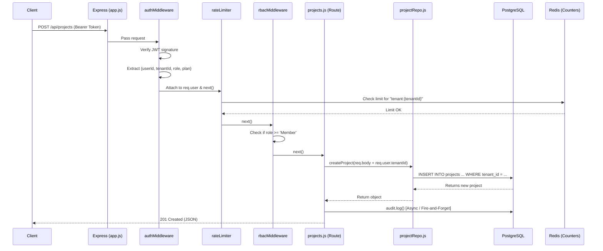

# Architecture & Deep Dive: Multi-Tenant SaaS API

This document serves as a comprehensive guide to the internal workings, design decisions, and architectural trade-offs of this multi-tenant SaaS backend. It is designed for engineers and reviewers who want to understand *how* and *why* this system was built the way it is.

---

## 1. The Multi-Tenancy Model

In a multi-tenant SaaS, the core challenge is ensuring that **Organization A can never access Organization B's data**.

There are three ways to solve this:
1. **Database-per-tenant:** Highest isolation, but extremely expensive and hard to manage (migrations must run on 100+ databases).
2. **Schema-per-tenant:** One database, multiple schemas. Medium isolation, but still requires running migrations per tenant.
3. **Shared Database, Shared Schema (Our Approach):** All tenants share the exact same tables. Data is separated logically via a `tenant_id` foreign key on every single row.

### Why we chose Shared Schema:
- **Cost Efficiency:** A single database pool serves all customers.
- **Maintainability:** A single database migration updates the schema for every tenant instantly.
- **The Trade-off:** The application layer must be 100% flawless at appending `WHERE tenant_id = $1` to every single query. If a developer forgets this, data leaks across tenants.

### How we mitigate the Shared Schema risk:
To prevent application-level bugs from leaking data, we strictly enforce that **the `tenant_id` is never trusted from user input**. 
1. The user authenticates.
2. The server signs a JWT containing the user's `tenant_id`.
3. On subsequent requests, the `authMiddleware` extracts the `tenant_id` directly from the cryptographically verified JWT.
4. This verified ID is passed to the Repository layer. 

An attacker cannot spoof their `tenant_id` because they cannot forge the JWT signature.

---

## 2. The Request Lifecycle (Workflow)

How does a request flow through the system? Let's trace `POST /api/projects`.

---

## 3. Core Architectural Decisions & Trade-offs

### A. 404 Not Found vs. 403 Forbidden
If a user from `Tenant A` tries to view a project belonging to `Tenant B` by guessing its UUID (`GET /api/projects/tenant-b-uuid`), the API returns a **404 Not Found**, *not* a 403 Forbidden.
- **Why:** Returning a 403 confirms to the attacker that the resource *does exist*, which is a form of information leakage. A 404 keeps the attacker entirely blind.

### B. Fire-and-Forget Audit Logging
When an action occurs (like creating a project), the route calls `audit.log(...)`. This function executes an `INSERT` query into the database but **does not await the result**.
- **The Trade-off:** 
  - *Pro:* The user's API request is lightning fast because it doesn't wait for the secondary audit write to complete.
  - *Con:* If the database is overwhelmed and the audit write fails, the user action succeeded but the audit log is lost.
- **Production upgrade:** In a strict compliance environment (like FinTech), this would be upgraded to write to a guaranteed message queue (e.g., Kafka, AWS SQS) first.

### C. Dynamic Plan-Based Rate Limiting
Rate limiting is handled by Redis, but it is keyed by `tenant_id`, not IP address. 
- **Why:** In B2B SaaS, a single tenant might have 100 employees in the same office sharing one public IP. If we limited by IP, they would constantly be blocked.
- **Dynamic Logic:** The rate limit threshold (`free` = 100 req/15m, `enterprise` = 2000 req/15m) is extracted from the JWT payload.

### D. UUIDs for Primary Keys
We use `gen_random_uuid()` for all primary keys instead of auto-incrementing integers (`1, 2, 3`).
- **Why:** 
  1. Prevents ID enumeration attacks (an attacker can't just run a script against `/api/projects/1`, `/api/projects/2`).
  2. Allows for easy distributed database sharding in the future.
- **The Trade-off:** UUIDs take up more space in memory and make database indexes slightly larger and slower to traverse than integers.

### E. Immutable Audit Logs via Database Triggers
The `audit_logs` table contains a snapshot of what changed (`old_values`, `new_values` as JSONB) and exactly what role the user had *at the time of the action*.
- **Defense in Depth:** Even if a rogue developer writes application code to delete an audit log, the database itself will reject it. We execute `REVOKE DELETE, UPDATE ON audit_logs FROM app_user;` in production. The database enforces immutability.

---

## 4. Security & Validation Middleware

1. **Helmet:** Automatically sets secure HTTP headers (e.g., HSTS, blocking MIME-sniffing, preventing Clickjacking via X-Frame-Options).
2. **Joi:** Validates the exact shape of incoming JSON payloads before they reach the business logic, preventing NoSQL/SQL injection and malformed data crashes.
3. **Bcrypt:** Hashes passwords using a salted, iterative algorithm (cost factor 10) to protect against rainbow table attacks in the event of a database breach. 

---

## 5. Summary

This backend is not just a standard CRUD app; it is a **defense-in-depth system**. Every layer—from the HTTP headers (Helmet), to the routing (Joi/JWT), to the data access (Tenant IDs), down to the database constraints (UUIDs, `REVOKE`)—is designed to protect tenant data and scale securely.
