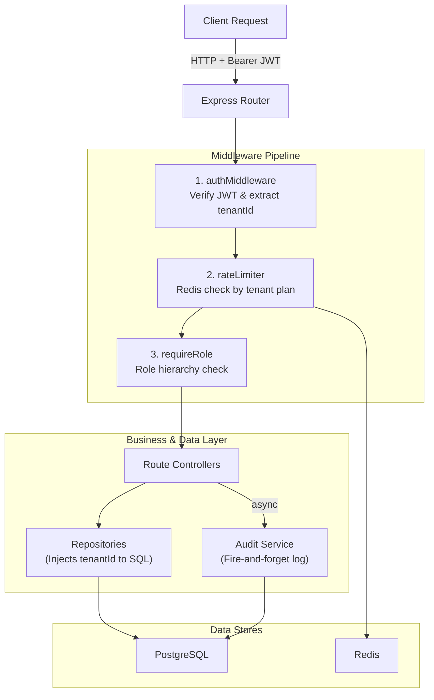

# 🏢 Multi-Tenant SaaS API Backend

A production-ready, highly secure multi-tenant REST API built with Node.js, Express, PostgreSQL, and Redis.

This architecture demonstrates how to build a backend where multiple organizations (tenants) share the same database while being guaranteed strict **data isolation**. It includes robust Role-Based Access Control (RBAC), dynamic plan-based rate limiting, JWT authentication (with refresh tokens), structured logging, and immutable audit trails.

## 🚀 Key Features

- **Strict Tenant Isolation:** Every database query filters by `tenant_id` extracted securely from the cryptographically verified JWT, preventing cross-tenant data leakage.
- **Hierarchical RBAC:** Middleware-enforced roles (`SuperAdmin`, `TenantAdmin`, `Member`, `Viewer`).
- **Dynamic Rate Limiting:** Redis-backed rate limiting that dynamically applies thresholds based on the tenant's subscription plan (`free`, `pro`, `enterprise`).
- **Secure Authentication:** `bcryptjs` password hashing and short-lived access tokens paired with long-lived refresh tokens.
- **Immutable Audit Logging:** Database-level triggers and write-only patterns ensure that audit logs cannot be tampered with, even by internal application bugs.
- **Structured JSON Logging:** Built with `pino` for high-performance, machine-readable logs compatible with Datadog/Splunk.
- **CI/CD Pipeline:** Fully configured GitHub Actions workflow for automated testing and migrations.

---

## 🏗️ Architecture



---

## 🛠️ Technology Stack

| Component | Choice | Rationale |
|---|---|---|
| **Runtime** | Node.js (Express) | Event-driven architecture ideal for high-concurrency API gateways. |
| **Database** | PostgreSQL | Relational integrity, JSONB support for audit diffs, and UUID constraints. |
| **Cache/Store** | Redis | Distributed, persistent rate-limit counters across scaled application instances. |
| **Migrations** | node-pg-migrate | Version-controlled database schema evolutions. |
| **Logging** | Pino | High-speed, structured JSON logging. |
| **Security** | Helmet, Cors, Joi | HTTP header protection, strict input validation, and secure origins. |

---

## 💻 Getting Started

### 1. Prerequisites
- Node.js (v18+)
- Docker & Docker Compose (for spinning up Postgres and Redis)

### 2. Setup

```bash
# Clone the repository
git clone https://github.com/AkshatVerma087/multi-tenant-saas-backend.git
cd multi-tenant-saas-backend

# Install dependencies
npm install

# Copy environment variables
cp .env.example .env

# Start Postgres and Redis via Docker Compose
docker-compose up -d

# Run Database Migrations
npm run migrate:up
```

### 3. Running the Server

```bash
# Development mode (with auto-reload)
npm run dev

# Production mode
npm start
```

### 4. Running Tests

Integration tests run against a real database to guarantee absolute tenant isolation.
```bash
npm test
```

---

## 🔐 API Reference

### Authentication
- `POST /api/auth/register` - Register a new tenant organization and initial Admin user.
- `POST /api/auth/login` - Authenticate and receive `accessToken` and `refreshToken`.
- `POST /api/auth/refresh` - Exchange a valid refresh token for a new access token.

### Projects
All endpoints require a valid `Bearer` token.
- `GET /api/projects` - List projects for your tenant (Supports `?limit=` & `?offset=`).
- `GET /api/projects/:id` - Get a specific project.
- `POST /api/projects` - Create a new project (Requires `Member` role or higher).
- `PUT /api/projects/:id` - Update a project (Requires `Member` role or higher).
- `DELETE /api/projects/:id` - Delete a project (Requires `TenantAdmin` role).

---

## 🛡️ Security Design Decisions

1. **404 over 403:** If Tenant A attempts to request a resource belonging to Tenant B, the API returns a `404 Not Found` rather than a `403 Forbidden`. This intentionally prevents information leakage about the existence of other tenants' resources.
2. **Stateless Tenant Context:** The `tenant_id` is *never* accepted from a request body or URL parameter. It is strictly extracted from the cryptographically verified JWT payload, preventing IDOR (Insecure Direct Object Reference) vulnerabilities.
3. **Fire-and-forget Auditing:** Audit logs are written asynchronously. If the logging database goes down, user requests still succeed. The logs capture the user's role *at the exact time of the action*, ensuring historical accuracy even if permissions change later.
